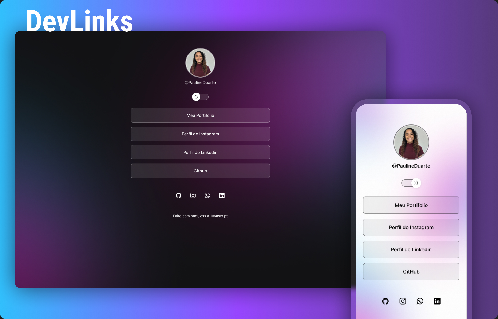

<h1 align="center"> Projeto DevLinks</h1>

  <a href="#-tecnologias">Tecnologias</a>&nbsp;&nbsp;&nbsp;|&nbsp;&nbsp;&nbsp;
  <a href="#-projeto">Projeto</a>&nbsp;&nbsp;&nbsp;|&nbsp;&nbsp;&nbsp;
  <a href="#-layout">Layout</a>&nbsp;&nbsp;&nbsp;|&nbsp;&nbsp;&nbsp;

 

  

## 🚀 Tecnologias

Esse projeto foi desenvolvido com as seguintes tecnologias:

- HTML e CSS
- JavaScript
- Git e Github

## 💻 Projeto
O Devlinks é um agregador de links para usar como cartão de visitas online.

## 🔖 Layout

Você pode visualizar o layout do projeto através [DESSE LINK](https://www.figma.com/file/tqJJ1m1cofZr0iYsm0a6yY/DevLinks-%E2%80%A2-Projeto-Pauline?type=design&node-id=0-1&mode=design&t=9Enqws2BOI1OA9xe-0). É necessário ter conta no [Figma](https://figma.com) para acessá-lo.

